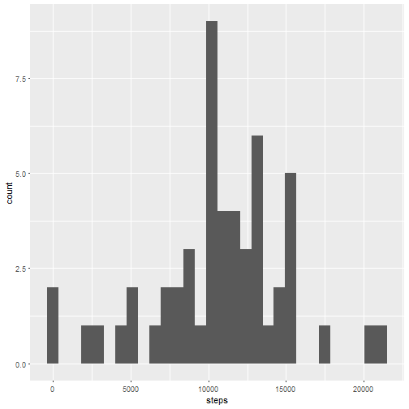
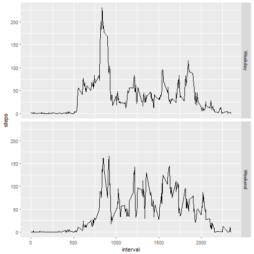

##0.read data and remove missing values


```r
setwd("C:/Users/xihui/Desktop/datascience related/Reproducible Research/week 2 project/Activity monitoring data")
library(ggplot2)
library(dplyr)
data<-read.csv("./activity.csv")
data_new<-na.omit(data)
```
##1.Calculate the total number of steps taken per day


```r
data.day <- group_by(data_new, date)
data.day <- summarize(data.day, steps=sum(steps))
head(data.day)
```

```
## # A tibble: 6 x 2
##   date       steps
##   <fct>      <int>
## 1 2012-10-02   126
## 2 2012-10-03 11352
## 3 2012-10-04 12116
## 4 2012-10-05 13294
## 5 2012-10-06 15420
## 6 2012-10-07 11015
```

##2.Make a histogram of the total number of steps taken each day


```r
qplot(steps,data = data.day)
```



##3.Calculate and report the mean and median of the total number of steps taken per day


```r
mean(data.day$steps)
```

```
## [1] 10766.19
```

```r
median(data.day$steps)
```

```
## [1] 10765
```
##4.Time series plot of the average number of steps taken


```r
data.int <- group_by(data_new, interval)
data.int <- summarize(data.int, steps=mean(steps))
ggplot(data.int, aes(interval, steps)) + geom_line()
```


##5.The 5-minute interval that, on average, contains the maximum number of steps

```r
maxInt <- data.int[which.max(data.int$steps),]
maxInt
```

```
## # A tibble: 1 x 2
##   interval steps
##      <int> <dbl>
## 1      835  206.
```

##6.Code to describe and show a strategy for imputing missing data

```r
data.na<-is.na(data$steps)
missingVals<-sum(data.na)
missingVals
```

```
## [1] 2304
```


```r
names(data.int)[2] <- "mean.steps"

data.impute <- merge(data, data.int)
data.impute$steps[is.na(data.impute$steps)] <- data.impute$mean.steps[is.na(data.impute$steps)]


data.day.imp <- group_by(data.impute, date)
data.day.imp <- summarize(data.day.imp, steps=sum(steps))
```

##7.Histogram of the total number of steps taken each day after missing values are imputed


```r
qplot(steps, data=data.day.imp)
```


##8.Panel plot comparing the average number of steps taken per 5-minute interval across weekdays and weekends

```r
data.impute$dayofweek <- weekdays(as.Date(data.impute$date))
data.impute$weekend <-as.factor(data.impute$dayofweek=="Saturday"|data.impute$dayofweek=="Sunday")
levels(data.impute$weekend) <- c("Weekday", "Weekend")

data.weekday <- data.impute[data.impute$weekend=="Weekday",]
data.weekend <- data.impute[data.impute$weekend=="Weekend",]

data.int.weekday <- group_by(data.weekday, interval)
data.int.weekday <- summarize(data.int.weekday, steps=mean(steps))
data.int.weekday$weekend <- "Weekday"

data.int.weekend <- group_by(data.weekend, interval)
data.int.weekend <- summarize(data.int.weekend, steps=mean(steps))
data.int.weekend$weekend <- "Weekend"

data.int <- rbind(data.int.weekday, data.int.weekend)
data.int$weekend <- as.factor(data.int$weekend)
ggplot(data.int, aes(interval, steps)) + geom_line() + facet_grid(weekend ~ .)
```



